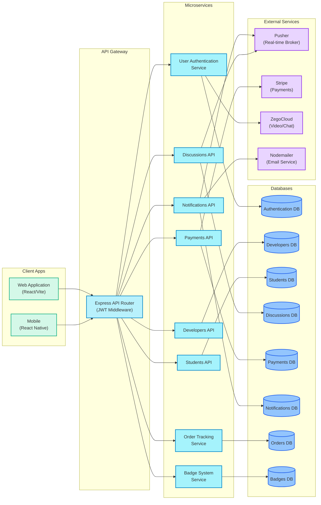

# CodeUnity Web Application Architecture

## CodeUnity Architecture Overview

This architecture is designed for the CodeUnity platform, which connects students with developers for collaboration, learning, and project development.

### Client Applications
- **Web Application**: Built with React.js and Vite for fast rendering and optimal performance
- **Mobile Interface**: Potential React Native implementation for cross-platform mobile access

### API Gateway
- **Express Router**: Centralized entry point that routes client requests to appropriate microservices
- **Authentication Middleware**: Validates JWT tokens and manages user sessions
- **Request Validation**: Ensures all incoming requests are properly formatted and validated

### Microservices

1. **User Authentication Service**
   - Manages user registration, login, and profile management
   - Handles OAuth integration with Google, GitHub, and LinkedIn
   - Implements JWT-based authentication and authorization

2. **Developers API**
   - Manages developer profiles, skills, and availability
   - Handles developer search with advanced filtering
   - Processes ratings and reviews for developers

3. **Students API**
   - Manages student profiles and project requirements
   - Tracks student progress and interactions
   - Handles student feedback and support requests

4. **Discussions API**
   - Powers forum functionality with threads and replies
   - Implements real-time comment updates
   - Handles content moderation and reporting

5. **Payments API**
   - Processes payments through Stripe integration
   - Manages subscription plans and billing cycles
   - Handles payment disputes and refunds

6. **Notifications API**
   - Delivers in-app notifications
   - Sends email notifications through Nodemailer
   - Manages real-time alerts with Pusher

7. **Order Tracking Service**
   - Manages project orders and their lifecycle
   - Tracks development milestones and deliverables
   - Handles order modifications and cancellations

8. **Badge System Service**
   - Implements gamification with achievement badges
   - Tracks user progress and awards accomplishments
   - Displays user achievements and recognition

### Databases
- **MongoDB**: NoSQL database storing data for all services
- **Mongoose**: Object Data Modeling library for schema validation

### External Services
- **Pusher**: Real-time messaging and notifications
- **Stripe**: Payment processing and subscription management
- **ZegoCloud**: Video communication and streaming
- **Nodemailer**: Email delivery service

### Communication Patterns
- RESTful API communication between client and services
- WebSocket connections for real-time features
- Service-to-service communication through internal APIs

### Security Features
- JWT-based authentication for secure API access
- Password encryption with Bcrypt
- CORS configuration for API protection
- Input validation and sanitization to prevent injection attacks 