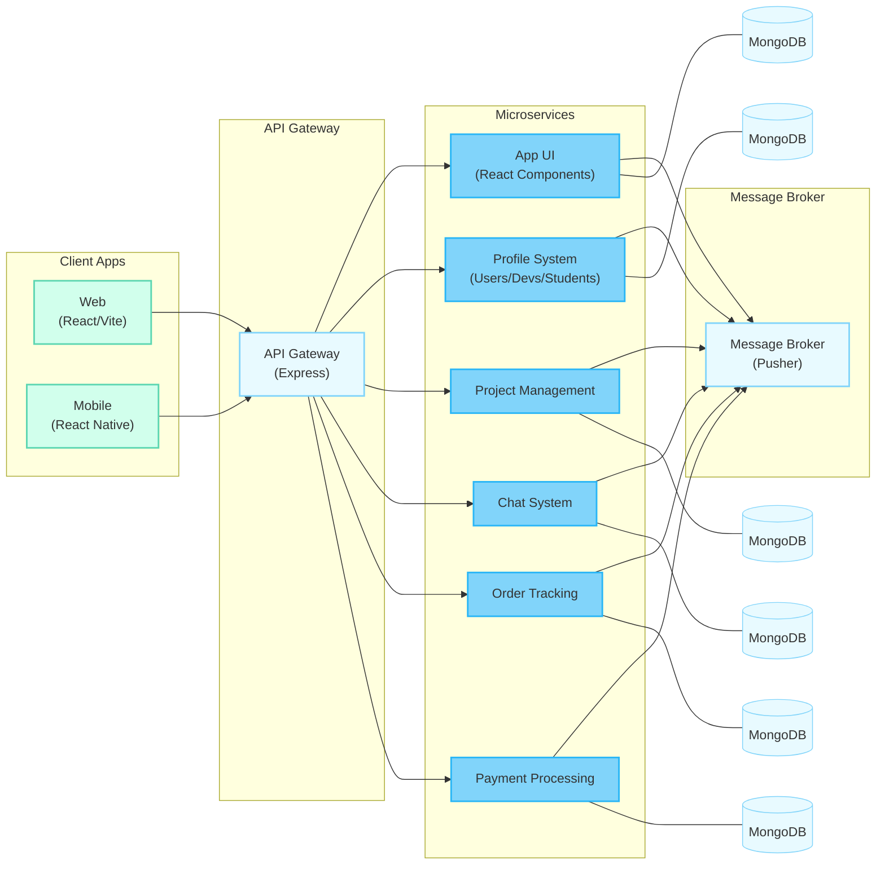

# CodeUnity Architecture Diagram

## CodeUnity Microservices Architecture

The CodeUnity platform uses a modern microservices architecture to provide a scalable and maintainable system for connecting students with developers.

### Client Applications
- **Web Application**: React.js with Vite for optimized performance
- **Mobile App**: Future React Native implementation

### API Gateway
- **Express API Gateway**: Central entry point for routing all client requests
- **Authentication/Authorization**: JWT validation and role-based access control

### Microservices

1. **App UI Service**
   - Manages UI components and presentation logic
   - Handles theme customization and user preferences
   - Provides responsive interface elements

2. **Profile System**
   - User authentication with email and OAuth providers
   - Developer profiles with skills, portfolio, and availability
   - Student profiles with academic information and project needs

3. **Project Management**
   - Project creation and requirements specification
   - Collaboration tools and document sharing
   - Progress tracking and milestone management

4. **Chat System**
   - Real-time messaging between students and developers
   - Group discussions and thread management
   - Video conferencing integration via ZegoCloud

5. **Order Tracking**
   - Order creation and lifecycle management
   - Status updates and notifications
   - Delivery and acceptance workflow

6. **Payment Processing**
   - Secure payment handling via Stripe
   - Subscription management for premium features
   - Transaction history and invoicing

### Message Broker
- **Pusher**: Real-time event distribution between services
- Event-driven architecture for responsive updates
- Ensures scalability for high-traffic scenarios

### Data Storage
- **MongoDB**: NoSQL database for flexible schema development
- Separate database instances for each microservice
- Mongoose ODM for data validation and modeling

### External Services Integration
- **Stripe**: Payment processing
- **ZegoCloud**: Video and audio communication
- **OAuth Providers**: Google, GitHub, LinkedIn authentication

This architecture provides:
- **Scalability**: Independent scaling of services based on demand
- **Maintainability**: Services can be developed and deployed independently
- **Resilience**: Failure in one service doesn't bring down the entire system
- **Technology Flexibility**: Different services can use specialized tools 